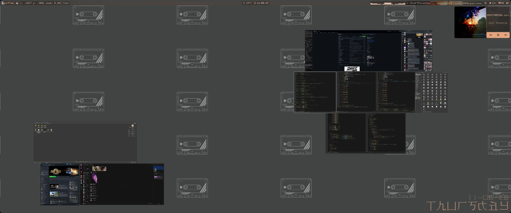
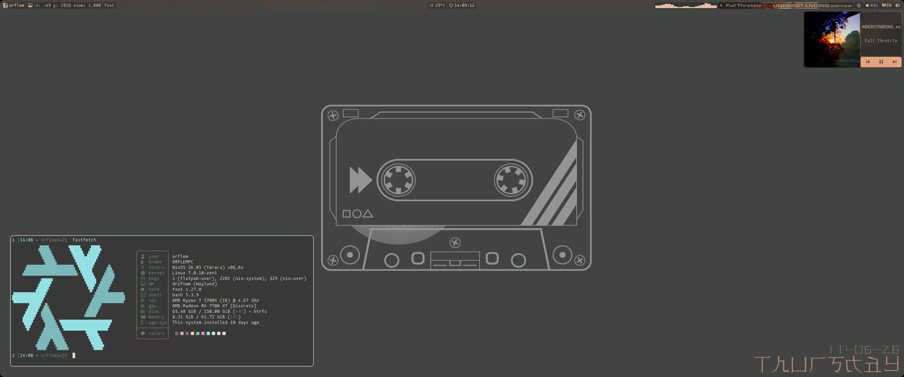

<div align="center">
	
	<h1>Just Enough Shell</h1>
	<p>Gemacht für den Alltag, nicht für Bilder.</p>
</div>

***

## -- Tastenkombinationen für DriftWM -- :
| Kombination | Was es tut |
| :--- | :---: |
| `super + e` | Dateimanager |
| `super + q` \| `super + enter` | Terminal |
| `super + p` | Energie-Buttons |
| `super + ctrl + Pfeiltasten` oder `super + LMT` (auf der Leinwand auch ohne super möglich) | Bewegen auf der Leinwand |
| `super + Mausrad scrollen` (auf der Leinwand auch ohne super möglich) | Heranzoomen \| Herauszoomen |
| `super + RMT` oder `alt + RMT` | Fenstergröße ändern |
| `super + shift + Pfeiltasten` oder `alt + LMT` | Fenster verschieben |
| `super + Pfeiltasten` | Wechsel zwischen Fenstern |
| `super + f` | Ändern des Fenstertyps: schwebend oder Tiling |
| `super + w` | Neustart der Oberfläche |
| `home` | Vollbildschirmfoto |
| `shift + home` | Screenshot eines ausgewählten Bereichs |
| `super + d` | App-Launcher öffnen |
| `super + 0` | zur Mitte der Leinwand springen |
| `super + tab` | zurück zur Mitte der Leinwand \| zurück zum zuletzt aktiven Programm |
| `capslock` oder `shift + alt` | Sprache wechseln |
| `shift + capslock` | Caps Lock ein- \| ausschalten |
| `super + space` | Fenster über andere legen |
| `alt + F4` | Musik abspielen \| anhalten |
| `alt + F3` | nächster Titel |
| `alt + F2` | vorheriger Titel |
| `alt + pgup` | Helligkeit erhöhen |
| `alt + pgdn` | Helligkeit verringern |
| `alt + F9` | Ton stummschalten |
| `alt + F10` | leiser |
| `alt + F11` | lauter |
| `alt + F12` | Player öffnen \| schließen |

### Weitere Tastenkombinationen, die ich eventuell vergessen habe, finden Sie bei (DriftWM)[https://github.com/malbiruk/driftwm]

## -- So sieht JES unter DriftWM aus -- :
### Desktop



### Steuerleiste


### Hintergrundauswahl


### Player


### Energie-Buttons


### fastfetch


### Lautstärke- und Ton-Popup


### App-Launcher


### Bildschirmsperre


### bash-Zeile
```
1 [02:00 - orflem:~]$  cd gits/just_enough_shell/
2 [02:00 - orflem:~/gits/just_enough_shell main]$  
```
Befehlsnummer, Datum, Benutzer, Verzeichnis, Git-Status (beim Öffnen eines mit Git verknüpften Projekts)
