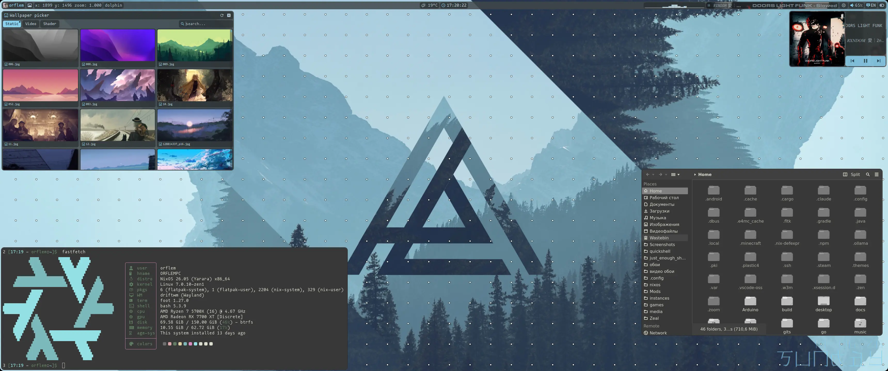
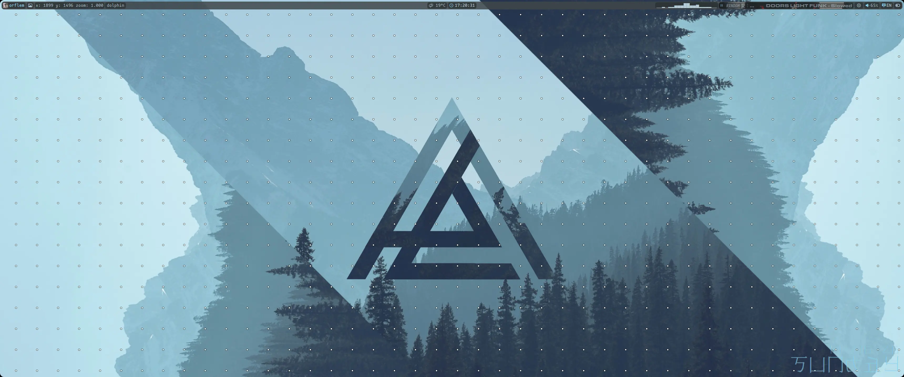
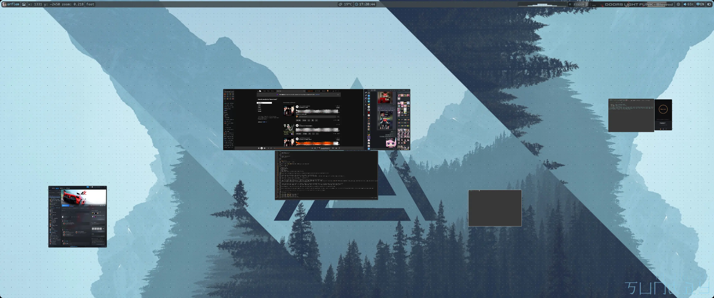
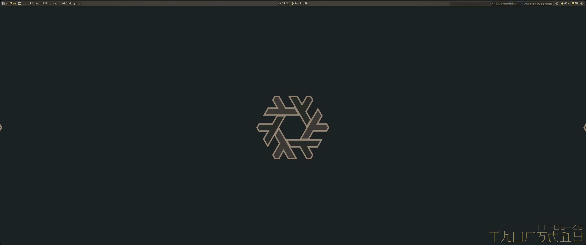
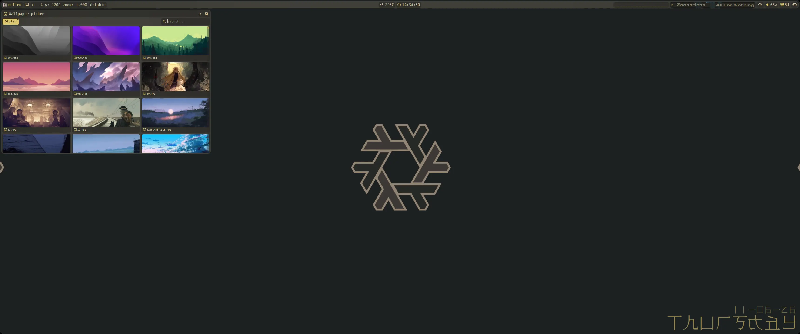
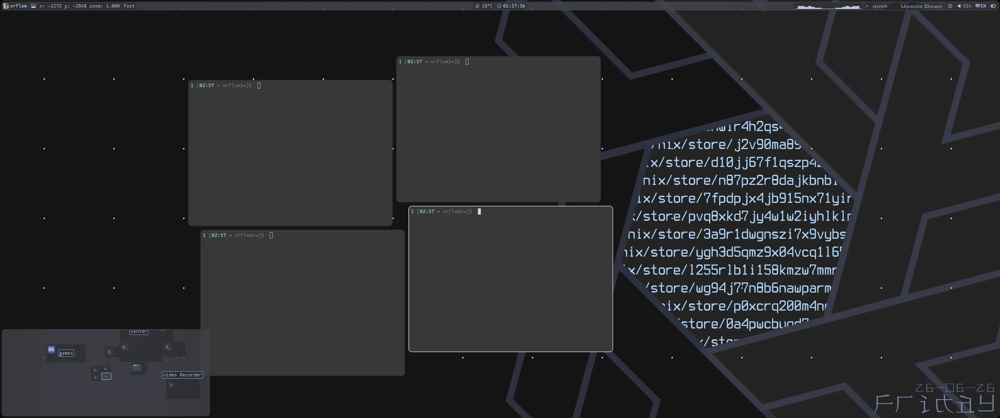

<div align="center">
	
	<h1>Just Enough Shell</h1>
	<p>Built for everyday use, not for screenshots.</p>
</div>

***

## -- Keybindings for DriftWM -- :
| keybinding | action |
| :--- | :---: |
| `super + e` | file manager |
| `super + q` \| `super + enter` | terminal |
| `super + p` | power buttons |
| `super + ctrl + arrows` or `super + LMB` (on canvas, super is optional) | move around the canvas |
| `super + mouse scroll` (on canvas, super is optional) | zoom in \| zoom out |
| `super + RMB` or `alt + RMB` | resize windows |
| `super + shift + arrows` or `alt + LMB` | move window |
| `super + arrows` | switch between windows |
| `super + f` | toggle window type: floating or tiling |
| `super + w` | restart the interface |
| `super + m` | open \| close minimap |
| `home` | fullscreen screenshot |
| `shift + home` | screenshot of selected area |
| `super + d` | open app launcher |
| `super + 0` | go to canvas center |
| `super + tab` | return to canvas center \| return to last active window |
| `capslock` or `shift + alt` | switch language |
| `shift + capslock` | toggle caps lock |
| `super + space` | raise window above others |
| `alt + F4` | play \| pause music |
| `alt + F3` | next track |
| `alt + F2` | previous track |
| `alt + pgup` | increase brightness |
| `alt + pgdn` | decrease brightness |
| `alt + F9` | mute |
| `alt + F10` | volume down |
| `alt + F11` | volume up |
| `alt + F12` | open \| close player |

### Other bindings I may have missed can be found in [DriftWM](https://github.com/malbiruk/driftwm)

## -- How JES looks on DriftWM -- :
### Desktop



### Control bar


### Wallpaper picker


### Minimap


### Player


### Power buttons


### fastfetch


### Volume / audio popup


### App launcher


### Lock screen


### bash prompt
```
1 [02:00 - orflem:~]$  cd gits/just_enough_shell/
2 [02:00 - orflem:~/gits/just_enough_shell main]$  
```
command number, time, user, directory, git status (when inside a git-tracked project)
