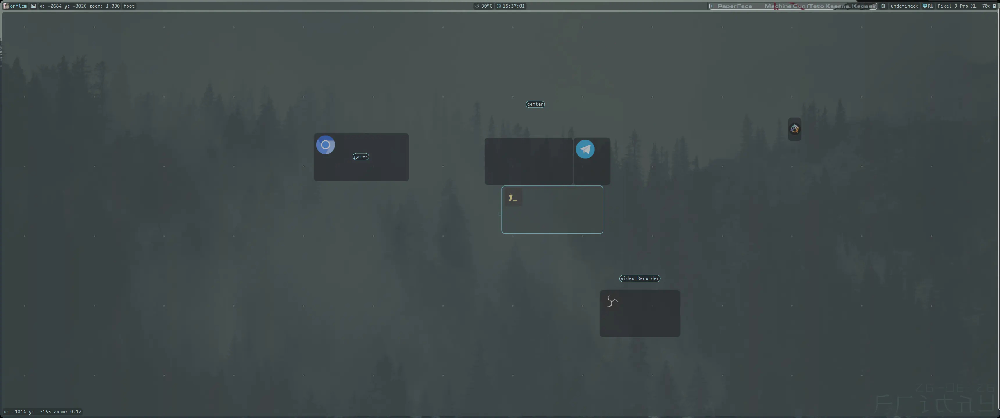

<div align="center">
	
	<h1>Just Enough Shell</h1>
	<p>Создан для повседневности, не для картинок.</p>
</div>

***

## -- Комбинации клавиш для DriftWM -- :
| комбинация | что делает |
| :--- | :---: |
| `super + e` | файловый менеджер |
| `super + q` \| `super + enter` | терминал |
| `super + p` | Кнопки питания |
| `super + ctrl + стрелки` или `super + лкм` (по холсту без super можно) | перемещение по холсту |
| `super + прокрутка колёсика мыши` (по холсту без super можно) | приближение \| отдаление |
| `super + пкм` или `alt + пкм` | ресайз окон |
| `super + shift + стрелки` или `alt + лкм` | перемещение окна |
| `super + стрелки` | переключение между окнами |
| `super + f` | изменение типа окна: плавующий или в тайлинге |
| `super + w` | перезапуск интерфейса |
| `super + m` | открыть \| закрыть миникарту |
| `home` | полноэкранный снимок |
| `shift + home` | снимок выделенной области |
| `super + d` | открыть лаунчер приложений |
| `super + 0` | перейти на центр холста |
| `super + tab` | вернуться на центр холста \| вернуться к последней активной программе |
| `capslock` или `shift + alt` | смена языка |
| `shift + capslock` | включить \| выключить капс |
| `super + space` | раскрыть окно, поверх других |
| `alt + F4` | воспроизвести \| остановить музыку |
| `alt + F3` | следующий трек |
| `alt + F2` | предыдущий трек |
| `alt + pgup` | повысить яркость |
| `alt + pgdn` | понизить яркость |
| `alt + F9` | выключить звук |
| `alt + F10` | тише |
| `alt + F11` | громче |
| `alt + F12` | открыть \| закрыть проигрыватель |

### управление миникартой:
- нажатие на колёсико - раскрыть миникарту в полцноценную карту
- зажать пкм и двигать мышку - передвигаться по миникарте
- лкм по программе или путевой точке - передвинуться на данную координату

### Остальные бинды, которые я мог упустить можно посмотреть в [DriftWM](https://github.com/malbiruk/driftwm)

## -- Как выглядит JES на DriftWM -- :
### Рабочий стол


### Панель управления


### Выбор обоев


### Mиникарта



### Проигрыватель


### Кнопки питания


### fastfetch


### popup громкости и звука


### Лаунчер приложений


### блокировка экрана


### bash строка
```
1 [02:00 - orflem:~]$  cd gits/just_enough_shell/
2 [02:00 - orflem:~/gits/just_enough_shell main]$  
```
номер команды, дата, юзер, директория, состояние гита (при открытии проекта, связанный с git)
