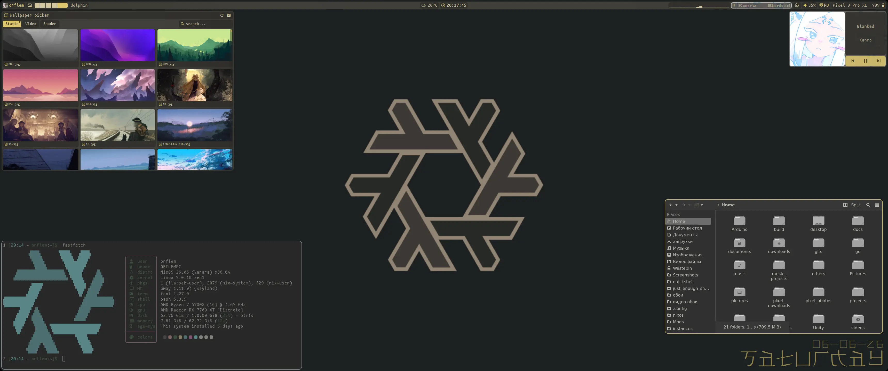
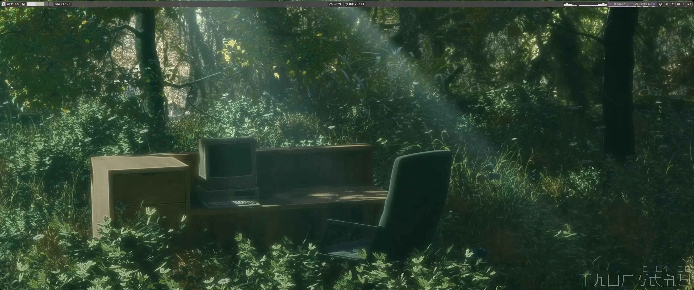
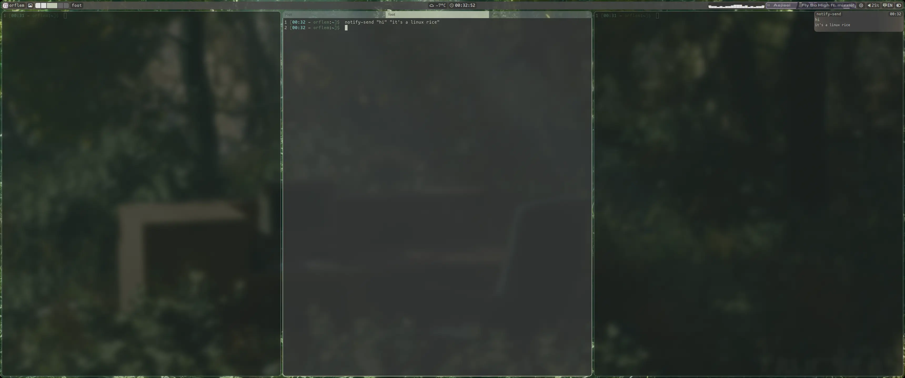
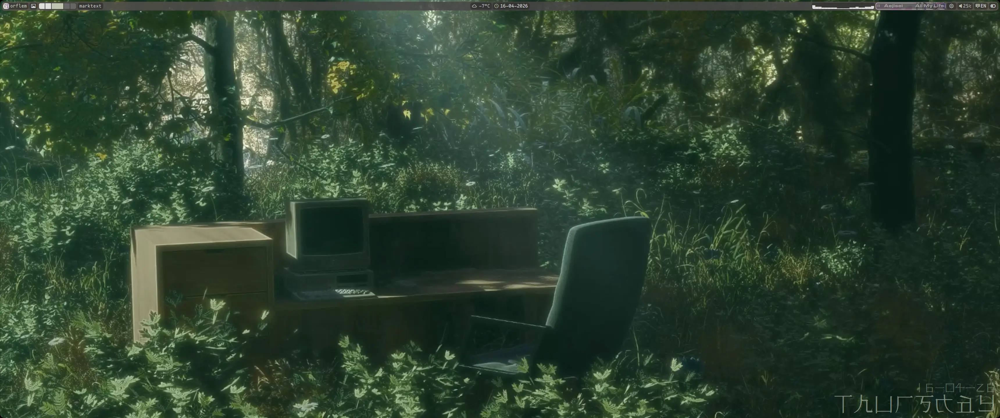
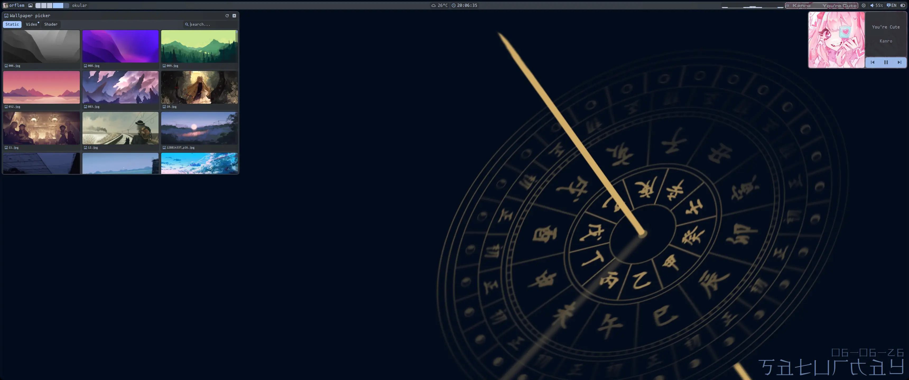
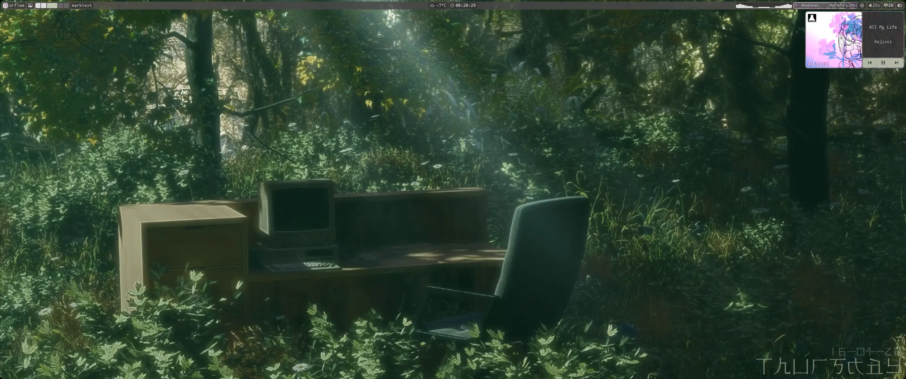
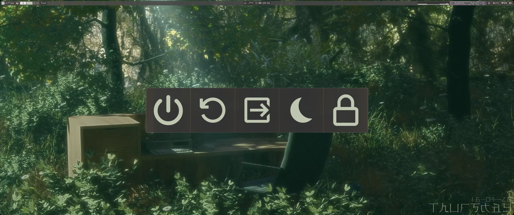
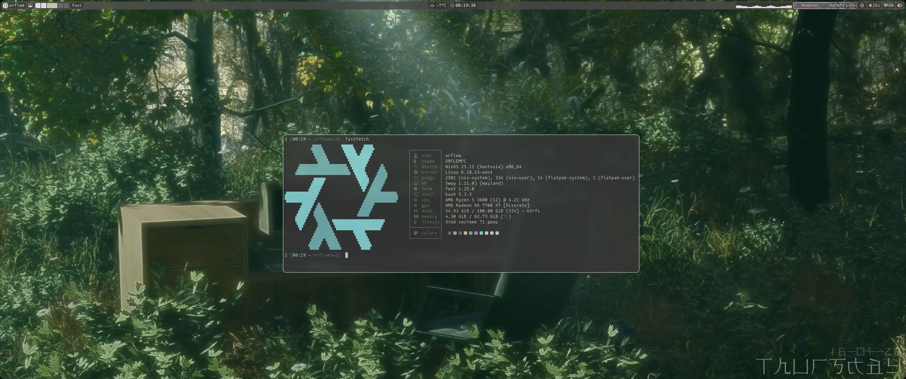
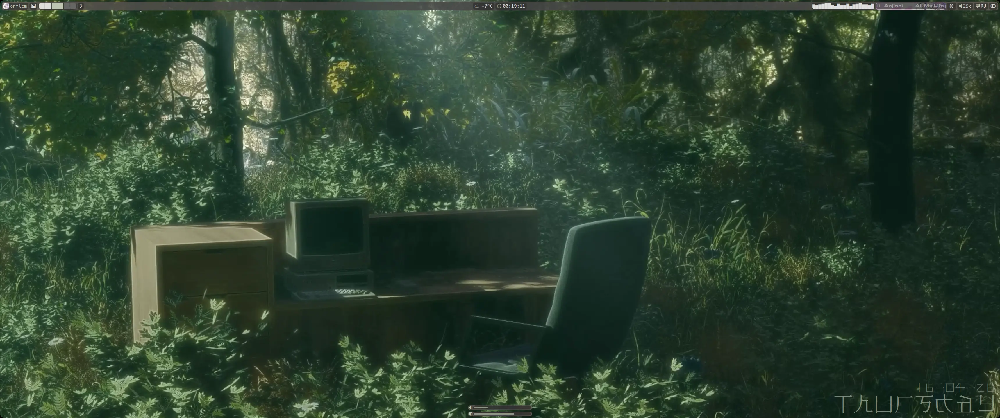

<div align="center">
  
  
  
	
	<h1>Just Enough Shell</h1>
	<p>Gemacht für den Alltag, nicht für Bilder.</p>
</div>

***

<table align="right">
	<tr>
		<td colspan="2" align="center">Systemparameter</td>
	</tr>
	<tr>
		<th>Komponente</th>
		<th>Wert</th>
	</tr>
	<tr>
		<td>OS</td>
		<td>NixOS 26.05</td>
	</tr>
	<tr>
		<td>WM</td>
		<td>SwayFX / Hyprland / niri / DriftWM</td>
	</tr>
	<tr>
		<td>Shell</td>
		<td>bash</td>
	</tr>
	<tr>
		<td>Terminal</td>
		<td>Foot</td>
	</tr>
	<tr>
		<td>Interface</td>
		<td>QuickShell</td>
	</tr>
	<tr>
		<td>Screen Locker</td>
		<td>Hyprlock</td>
	</tr>
	<tr>
		<td>Monitoring</td>
		<td>Btop</td>
	</tr>
	<tr>
		<td>Audio</td>
		<td>PipeWire</td>
	</tr>
	<tr>
		<td>Browser</td>
		<td>Zen browser</td>
	</tr>
	<tr>
		<td>File Manager</td>
		<td>ranger / yazi / dolphin</td>
	</tr>
	<tr>
		<td>Editor</td>
		<td>micro / helix</td>
	</tr>
	<tr>
		<td>Theme</td>
		<td>zenburn</td>
	</tr>
	<tr>
		<td>Icons</td>
		<td>Tela Gray</td>
	</tr>
	<tr>
		<td>Bootloader</td>
		<td>Grub</td>
	</tr>
	<tr>
		<td>Optimierung</td>
		<td>Go-Binärdateien</td>
	</tr>
	<tr>
		<td>Theme-Wechsler</td>
		<td>matugen</td>
	</tr>
</table>

<div align="left">
	<h3>-- Über das Projekt --:</h3>
	<p>
  <i>JES</i> verwendet <b>QuickShell</b> zur Darstellung der Oberfläche.<br>
  <br>
	<i>JES</i> unterstützt:
	<ul>
  	<li>SwayFX</li>
  	<li>Hyprland</li>
  	<li>Niri</li>
		<li>DriftWM</li>
		<li>Jeden anderen über 3 Skripte und eine qml-Datei</li>
	</ul>
	<b>Niri</b> hat keine Transparenz und aufgrund seiner Architektur einen Bug bei den Workspaces in der Leiste.<br>
	<br>
	Das Projekt ist optimiert, wurde aber nicht auf schwachen PCs getestet.<br>
	Go-Binärdateien werden für Skripte verwendet, bei denen eine schnelle Verarbeitung großer Datenmengen wichtig ist – dadurch liegt die CPU-Auslastung im Leerlauf bei 7–11&nbsp;% statt bei 35–45&nbsp;%.<br>
  <br>
	Das Projekt hat ein einfaches Plugin-System, das es erweiterbar macht.<br>
	<br>
	<i>JES</i> wurde für Desktop-PCs konzipiert, was es ermöglicht, es besser auf solch großartige Maschinen abzustimmen.<br>
	Der Monitor des Autors ist UWQHD (3440x1440), getestete Auflösungen: FHD (1920x1080) und höher. (FHD (1920x1080) wird nativ unterstützt, <b>aber</b> bei aktiviertem minibar kann es zu Bugs kommen, da sich die Größe nicht ändert, das Anzeigemodell jedoch schon)<br>
	Bei diesen hat die Leiste keine Probleme mit der Anordnung der Module.<br>
	Mehrere Monitore werden nativ unterstützt.<br>
	<br>
	Das Projekt verwendet bash mit angepasster Ausgabe und wird für SwayFX und DriftWM schneller aktualisiert, da es auf den Autor und seinen Alltagsgebrauch ausgerichtet ist.<br>
	Genau das verleiht dem Projekt Beständigkeit, denn während der Autor seinen alltäglichen Aufgaben nachgeht, entwickelt sich das Projekt weiter und wird stetig verbessert.<br>
	<br>
	Für eine schnellere Ladezeit hat der Autor entschieden, keine Videohintergründe von den Bildern hier einzubinden, sondern nur einen Link dazu bereitzustellen.<br>
	<br>
	Das <i>zenburn</i>-Theme gilt <b>nicht</b> für <i>JES</i> selbst, sondern nur für Programme, das tty (nur NixOS) und Ähnliches – <i>JES</i> hat ein eigenes, generiertes Theme + Unterstützung für base16-Themes über base16.json<br>
	<br>
  <i>JES orientiert sich nicht an Trends, sondern an Praktikabilität im Alltag und Komfort.</i><br>
	</p>
	<h3>-- Weiterer Fahrplan --:</h3>
	<p>
	<b>[c]</b> Hinzufügen der Unterstützung für <b>Hyprland</b><br>
  <b>[c]</b> Hinzufügen der Unterstützung für <b>Niri</b><br>
	<b>[c]</b> Hinzufügen der Unterstützung für <b>DriftWM</b><br>
	<b>[c]</b> Unterstützung für base16-Themes in JES<br>
  <b>[c]</b> Sanftes material you<br>
	<b>[c]</b> Anzeige von Informationen über ein über kdeconnect verbundenes Gerät<br>
	<b>[c]</b> Hübscher screen picker<br>
	<b>[c]</b> Animiertes Cover im Player, wenn kein Cover vorhanden ist<br>
	<b>[c]</b> Schutz vor statischen Hintergründen mit falschem Format im wallpaper picker<br>
	<b>[c]</b> Erstellung eines Kalender-Widgets<br>
	<b>[c]</b> Unterstützung mehrerer Monitore<br>
  <b>[c]</b> Erstellung eines Konfigurations-Installers<br>
	<b>[c]</b> Auswahl des Stils neutral/auffällig<br>
	<b>[i]</b> Umstellung von <b>Hyprland</b> auf lua-Konfigurationen<br>
	<b>[i]</b> Fix für <b>Niri</b><br>
	<b>[p]</b> Erstellung eines Wetter-Widgets<br>
	<b>[n]</b> Auswahl des Themes dunkel/hell<br>
	c = completed; n = not completed; i = in progress; p = planned.<br> 
	</p>
</div>

> **Für wen ist *JES*?** 
> - Desktop-PCs mit FHD+-Auflösung (der Autor verwendet UWQHD)
> - Nutzer von SwayFX / Hyprland / Niri / DriftWM oder Enthusiasten mit Zeit für die Ersteinrichtung (die Shell selbst läuft auf jedem WM, aber dann fehlen die Tastenkombinationen und Tiling-Einstellungen)
> - Wer Performance und Architektur über Trends stellt
> - Wer eine angenehme und für CPU/GPU leichtgewichtige Oberfläche braucht
> 
> Wenn Sie zu dieser Zielgruppe gehören — willkommen. 
> Wenn nicht — dann ist das Projekt vielleicht nichts für Sie, und das ist völlig in Ordnung.

## -- WICHTIG -- :
- Nvidia-Grafikkarten funktionieren FURCHTBAR, **alles kann jederzeit grundlos einfrieren**, der Autor plant nicht, dieses Problem zu lösen, da es sich um **Probleme auf Treiberseite** handelt!
- Der Autor hat keine Erfahrung mit Arch Linux, die Installation unter Arch kann daher fehlerhaft sein. Sollte das der Fall sein, beschreiben Sie das Problem bitte in einem Issue und schlagen Sie nach Möglichkeit einen Fix vor
- Die Installationsanleitung befindet sich ganz unten
- Der Autor ist offen für Vorschläge und hilft beim Einstieg in das Projekt; bei Problemen bitte ein [Issue](https://github.com/ORFLEM/just_enough_shell/issues/new) erstellen

```
Wer lebendige Videohintergründe möchte, kann zwischen Videohintergründen und Shadern wählen (Letzteres funktioniert möglicherweise nicht gut mit der automatischen Theme-Generierung von JES)
```
#### **Hintergründe aus den Screenshots**: [hier](https://moewalls.com/lifestyle/touch-grass-live-wallpaper/)

## [Struktur von *JES*](./structure_deu.md)

## -- Was sich in *JES* anpassen lässt --:
- `wm` - auto, aber für die Anbindung eines WM, das nicht in der Liste der verfügbaren steht, muss der Name großgeschrieben angegeben werden
- `wm_type` - auto, aber für ein WM außerhalb der Liste stehen workspaces oder coordinates zur Auswahl
- `mainRad` - Eckenradius, standardmäßig 10, funktioniert einwandfrei mit Werten von 0-25
- `barOnTop` - Steuerleiste oben sowie die zugehörigen Widgets, standardmäßig aktiviert
- `minibar` - macht die Leiste 1920px breit, standardmäßig deaktiviert
- `BarHeight` - Höhe der Leiste, standardmäßig 30
- `fontSize` - Schriftgröße, standardmäßig 17
- `fontFamily` - Schriftart, standardmäßig Mononoki Nerd Font Propo
- `custom_wallpaper_engine` - integrierte Hintergründe deaktivieren, standardmäßig false
- `disableGenerate` — Umschaltung des JES-matugen-Themas auf base16, standardmäßig false
- `doNotDisturb` - stiller Modus, standardmäßig false
- `timezone` — die Stadt für das Wetter-Widget; standardmäßig nicht vorhanden, der Wert wird aus der `user-config.toml`-Datei der NixOS-Konfiguration übernommen.

```
Wichtig: config.toml liegt im Quickshell-Ordner (~/.config/quickshell/)
In der .bashrc hat der Autor einen Alias hinterlegt – wer es sich sparen möchte, alles einzutippen, gibt einfach in der Konsole ein:
	edit-JES
Im Alias wird micro verwendet, zum Beenden Strg+Q, zum Speichern Strg+s
```

## [JES für DriftWM](./DriftWM_deu.md)

## -- Tastenkombinationen für SwayFX, Hyprland und Niri -- :
| Kombination | Was es tut |
| :--- | :---: |
| `super + e` | Dateimanager |
| `super + q` \| `super + enter` | Terminal |
| `super + p` | Energie-Buttons |
| `super + 1-0` oder `super + scrll up \| scrll dwn` | Wechsel zwischen Arbeitsflächen |
| `super + shift + 1-0` oder `super + shift + Pfeiltasten` | Verschieben von Programmen zwischen Arbeitsflächen |
| `super + RMT` | Fenstergröße ändern |
| `super + shift + Pfeiltasten` oder `super + LMT` | Fenster verschieben |
| `super + Pfeiltasten` | Wechsel zwischen Fenstern |
| `super + alt + LMT` | Ändern des Fenstertyps: schwebend oder Tiling |
| `super + w` | Neustart der Oberfläche |
| `home` | Vollbildschirmfoto |
| `shift + home` | Screenshot eines ausgewählten Bereichs |
| `super + d` | App-Launcher öffnen |
| `super + g` | Gruppe erstellen |
| `super + ctrl + g` | Programme aus der Gruppe entfernen |
| `super + tab` | letzte Arbeitsfläche |
| `capslock` oder `shift + alt` | Sprache wechseln |
| `shift + capslock` | Caps Lock ein- \| ausschalten |
| `super + space` | Fenster über andere legen |
| `ctrl + /` | Musik abspielen \| anhalten |
| `ctrl + .` | nächster Titel |
| `ctrl + ,` | vorheriger Titel |
| `alt + pgup` | Helligkeit erhöhen |
| `alt + pgdn` | Helligkeit verringern |
| `alt + F9` | Ton stummschalten |
| `alt + F10` | leiser |
| `alt + F11` | lauter |
| `alt + F12` | Player öffnen \| schließen |

### Die Wahl der Taste für Screenshots wurde nach oben verlegt, da nicht jedem `home` zusagt oder die Taste fehlen kann – wie beim Autor, dessen Tastatur keine print-screen-Taste hat

### [Tastenkombinationen für DriftWM](./DriftWM_deu.md)

## -- So sieht *JES* aus --:
### Desktop



### Steuerleiste (die DriftWM-Version unterscheidet sich, siehe [`DriftWM_deu.md`](./DriftWM_deu.md))


### Hintergrundauswahl


### Player



### Energie-Buttons


### fastfetch


### Lautstärke- und Ton-Popup


### App-Launcher


### Bildschirmsperre


### bash-Zeile
```
1 [02:00 - orflem:~]$  cd gits/just_enough_shell/
2 [02:00 - orflem:~/gits/just_enough_shell main]$  
```
Befehlsnummer, Datum, Benutzer, Verzeichnis, Git-Status (beim Öffnen eines mit Git verknüpften Projekts)

## -- Plugins --:
### Installation
```
1. Öffnen Sie ~/.config/quickshell/
2. Legen Sie den Plugin-Ordner dort ab
3. Öffnen Sie config.toml
4. Tragen Sie folgende Zeilen ein:
   [plugin.plugin-name]
   source = "Plugin-Ordner/Hauptdatei-des-Plugins.qml"
   active = true
```

### [Ausführliche Anleitung zur Plugin-Erstellung](./plugins_deu.md)

### [Plugin-Repository](./plugin_repo.md)
### Wichtig: Das Repository ist nur auf Englisch verfügbar, da dieser Teil stark von der Community des Projekts beeinflusst wird und es äußerst schwierig ist, alle kurzen Beschreibungen in verschiedene Sprachen zu übersetzen.

## -- Installation von JES --:
### NixOS- Installieren Sie NixOS
- Führen Sie das Installationsprogramm aus:
  ```bash
  nix-shell -p git --run "git clone https://github.com/ORFLEM/just_enough_shell.git && cd just_enough_shell && ./install.sh"
	```
- Starten Sie mit `reboot` neu

### Arch Linux oder Arch-basiert (kann fehlerhaft sein, bei Problemen bitte ein [Issue](https://github.com/ORFLEM/just_enough_shell/issues/new) erstellen)
```
1. Installieren Sie Arch Linux (der Einfachheit halber wird EndeavourOS empfohlen)
2. Installieren Sie yay oder paru (yay: git clone https://aur.archlinux.org/yay.git && cd yay && makepkg -si)
3. Installieren Sie die offizielle Software (sudo pacman -Syu && pacman -S $(cat ./arch_official.txt))
4. Installieren Sie Benutzer-Software (yay -S $(cat ./arch_aur.txt))
5. Installieren Sie das zenburn-Theme für qt und gtk
6. Bei Bedarf können Sie die Systemthemes (GTK/Qt) auf zenburn anpassen und die Schriftart ter-v32n installieren
7. Erstellen Sie ein Backup der Benutzerkonfigurationen (cp -r ~/.config/ ~/backups/ && cp ~/.bashrc ~/backups)
8. Kopieren Sie die Dateien aus ".config/" nach "~/.config" und aus ".local/" nach "~/.local" (cp -r ./.local/* ~/.local/ && cp -r ./.config/* ~/.config/ && cp ./.bashrc ~/.bashrc)
9. Geben Sie reboot ein
```

> Das Skript funktioniert nur unter NixOS. Wenn Sie ein Skript für Arch wünschen, geben Sie bitte ein fertiges Skript an, der Autor wird es in das Projekt aufnehmen.

## -- Lizenz --:
Die Benachrichtigungen wurden aus dem Projekt [blxshell](https://github.com/binarylinuxx/dots) übernommen und sowohl visuell als auch teilweise technisch modernisiert, Lizenz **GNU GPL v3**
Ein Blick darauf lohnt sich

Diese Konfigurationen werden unter der Lizenz **GNU GPL v3** veröffentlicht.

Vereinfacht bedeutet das:
- Sie dürfen diesen Code frei verwenden, untersuchen und verändern.
- Wenn Sie Ihre Änderungen oder darauf basierenden Code mit anderen teilen (zum Beispiel einen Fork veröffentlichen), müssen Sie Ihren Quellcode **ebenfalls** offen und für alle zugänglich unter derselben Lizenz bereitstellen.

Das stellt sicher, dass alle Verbesserungen und abgeleiteten Werke genauso frei und offen bleiben wie das Original.

Den vollständigen Lizenztext finden Sie in der Datei [LICENSE](./LICENSE).

[](https://boosty.to/orflem.ru/)

##### Created by \_ORFLEM\_
