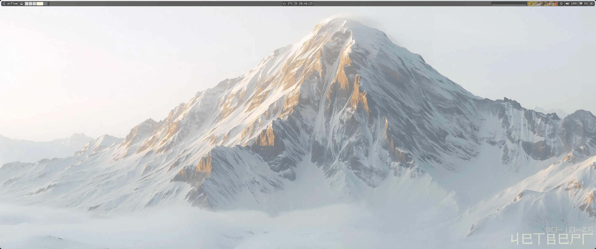
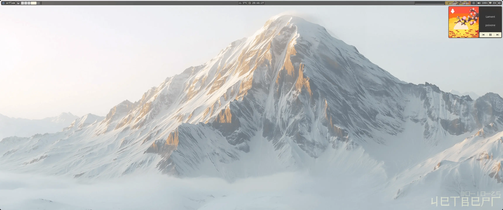
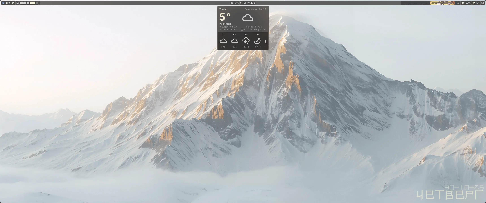
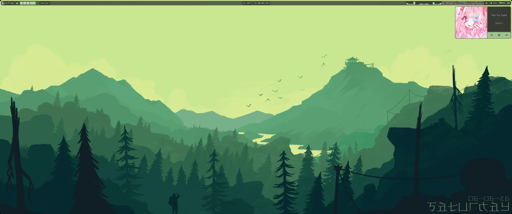
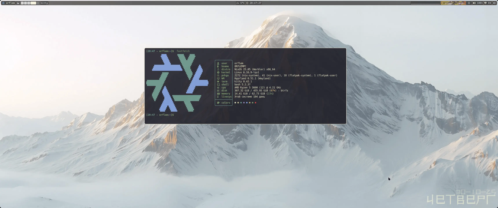
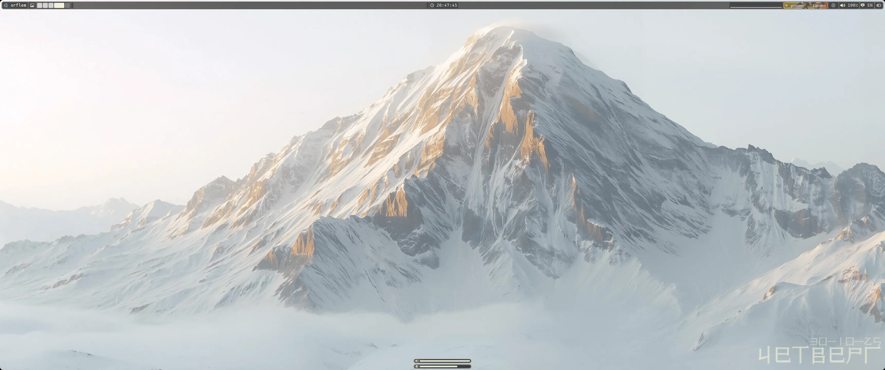
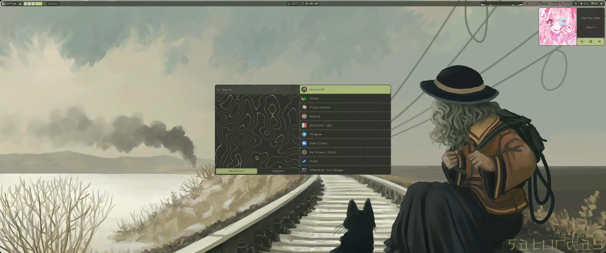

<div align="center">
	
	<h1>My NixOS Configs</h1>
	<p>Конфигурации <b>NixOS</b> для рабочего окружения на базе <b>quickshell</b>, <b>swayfx</b> с кастомным интерфейсом для ultrawide мониторов (21:9) и оптимизацией через <b>Go-бинарники</b>.</p>
</div>

***

<table align="right">
	<tr>
		<td colspan="2" align="center">Системные параметры</td>
	</tr>
	<tr>
		<th>Компонент</th>
		<th>Значение</th>
	</tr>
	<tr>
		<td>OS</td>
		<td>NixOS 25.11</td>
	</tr>
	<tr>
		<td>WM</td>
		<td>swayfx</td>
	</tr>
	<tr>
		<td>Shell</td>
		<td>bash</td>
	</tr>
	<tr>
		<td>Terminal</td>
		<td>Foot</td>
	</tr>
	<tr>
		<td>Interface</td>
		<td>quickshell</td>
	</tr>
	<tr>
		<td>Screen Locker</td>
		<td>Hyprlock</td>
	</tr>
	<tr>
		<td>Monitoring</td>
		<td>Btop</td>
	</tr>
	<tr>
		<td>Audio</td>
		<td>PipeWire</td>
	</tr>
	<tr>
		<td>Browser</td>
		<td>Zen browser</td>
	</tr>
	<tr>
		<td>File Manager</td>
		<td>ranger / yazi / dolphin</td>
	</tr>
	<tr>
		<td>Editor</td>
		<td>micro / helix</td>
	</tr>
	<tr>
		<td>Theme</td>
		<td>zenburn</td>
	</tr>
	<tr>
		<td>Icons</td>
		<td>Tela Gray</td>
	</tr>
	<tr>
		<td>Bootloader</td>
		<td>Grub</td>
	</tr>
	<tr>
		<td>Optimization</td>
		<td>Go binaries</td>
	</tr>
	<tr>
		<td>Accent changer</td>
		<td>wallust</td>
	</tr>
</table>

<div align="left">
	<h3>-- О проекте -- :</h3>
	<p>
  Эти конфиги, сделанные на базе Quickshell.<br>
  <br>
  <!-- Доступны <b>SwayFX и Hyrpland</b>, но <b>SwayFX</b> стабильнее и лучше работает, а также я сейчас на нём, из-за чего его конфиг 100% будет работать в отличии от <b>Hyprland</b>...<br> -->
  <!-- Может придётся посидеть и доработать <b>Hyprland</b> своими рукам, но я советую <b>SwayFX</b>.<br> -->
	Доступен <b>SwayFX</b>, но идут работы над добавлением поддержки <b>Hyprland и Niri</b>
  Также можно, отредактировав 3 скрипта-болванки, запустить данный интерфейс на любом wayland тайлинге С поддержкой subscribe протоколов для данных о воркспейсах, активном окне и раскладке.<br>
  <br>
  Я пытался проверить, смогу ли я создать весь ui только на <b>Quickshell</b>, не убив сильно производительность.<br>
  Но точно не скажу по поводу слабых ПК, ведь мой ПК достаточно мощный.<br>
	Go бинарники используются для скриптов, где важна быстрая скорость считывания большого потока данных, за счёт чего нагрузка на цп нынче около 5-7% в простое, ранее было 35-45%<br>
  <br>
  Проект не ориентирован на тренды, а на практичность повседневности и удобства.<br>
	</p>
	<h3>-- Дальнейший вектор -- :</h3>
	<p>
	<b>[i]</b> Добавление поддержки <b>Hyprland</b><br>
  <b>[p]</b> Добавление поддержки <b>Niri</b><br>
  <b>[p]</b> Создание установщика настроек<br>
	<b>[p]</b> Создание виджета погоды<br>
	<b>[p]</b> Создание виджета календаря<br>
	c = completed; n = not complited; i = in progress; p = planned.<br> 
	</p>
</div>

>[!WARNING]
> **Конфигурации предназначены для СТАЦИОНАРНОГО компьютера!**
> - Конфиги включают спорные или консервативные решения (bash вместо fish/zsh, приоритет на SwayFX)
> - Самые свежие апдейты будут приходить раньше на SwayFX, т.к. это основной мой wm, и проект неразрывно связан с моим повседневным использованием.
> - Конфиги включают **только статические** обои, изображение в репозитории визуально может отличаться от получаемых конфигов из-за других обоев!
> - Все настройки точно работают на ultrawide (21:9) мониторах или мониторах с разрешением выше 3440px в ширину, на других могут работать хуже.
> - Основная тема зафиксирована, с обоев берётся только акцент для интерфейса.
<!-- > - Hyprland без доработок работает только на NixOS -->
<!-- > - Плагин hy3 отсутствует в репозиториях ALT Linux -->

```
Если хочется живых видео обоев, то на выбор есть видеообои и шейдеры (последнее может плохо работать)
```

## -- Комбинации клавиш -- :
| комбинация | что делает |
| :--- | :---: |
| `super + e` | файловый менеджер |
| `super + q` | терминал |
| `super + o` | Кнопки питания |
| `super + 1` или `super + scrll up \| scrll dwn` | переключение между р. столами |
| `super + shift + 1` или `super + shift + стрелки` | перенос программ между р. столами  |
| `super + пкм` | ресайз окон |
| `super + shift + стрелки` или `super + лкм` | перемещение окна |
| `super + стрелки` | переключение между окнами |
| `super + alt + лкм` | изменение типа окна: плавующий или в тайлинге |
| `super + w` | перезапуск интерфейса |
| `super + s` | полноэкранный снимок |
| `super + d` | снимок выделенной области |
| `super` | открыть лаунчер приложений |
| `super + g` | создать группу |
| `super + ctrl + g` | разгруппировать программы |
| `super + tab` | прошлый р. стол |
| `capslock` или `shift + alt` | смена языка |
| `shift + capslock` | включить \| выключить капс |
| `super + space` | раскрыть окно, поверх других |
| `ctrl + /` | воспроизвести \| остановить музыку |
| `ctrl + .` | следующий трек |
| `ctrl + ,` | предыдущий трек |
| `alt + pgup` | повысить яркость |
| `alt + pgdn` | понизить яркость |
| `alt + F9` | выключить звук |
| `alt + F10` | тише |
| `alt + F11` | громче |
| `alt + F12` | открыть \| закрыть проигрыватель |

# как выглядят конфиги:
### Р.стол



### Панель управления


### Выбор обоев


### Проигрыватель



### Кнопки питания


### fastfetch


### popup громкости и звука


### Лаунчер приложений


### блокировка экрана


# Установка
```
1. Установить NixOS
2. Доработайте конфиг NixOS под себя, учтите, что нужно вписать своего юзера и доп. диски (если есть)
3. замените конфиг NixOS или впишите то, чего не хватает в конфиге для работы конфигов (почти весь мой конфиг)
4. из config перекинуть файлы в "~/.config", а из local в "~/.local"
5. sudo nixos-rebuild switch
6. Удачи попытаться понять логику автора
```

#### Лицензия
Уведомления были взяты из проекта [blxshell](https://github.com/binarylinuxx/dots) и модернизированны как визуально, так и частично технически, лицензия неизвестна

Эти конфигурации распространяются под лицензией **GNU GPL v3**.

Простыми словами это значит:
- Вы можете свободно использовать, изучать и изменять этот код.
- Если вы делитесь своими изменениями или собранной на основе этого кодом с другими (например, выложили форк), вы **обязаны** сделать ваш исходный код также открытым и доступным для всех под этой же лицензией.

Это гарантирует, что все улучшения и производные работы останутся свободными и открытыми, как и оригинал.

Полный текст лицензии см. в файле [LICENSE](./LICENSE).

[](https://boosty.to/orflem.ru/)
